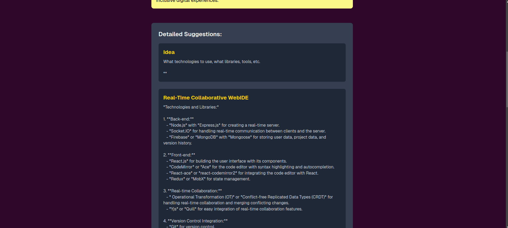

# Idea Generator

The **Idea Generator** is a web application that helps users generate creative app ideas based on their input and provides detailed suggestions for the selected ideas. This application is designed to simplify the brainstorming process and provide inspiration for app development.

## Screenshots

### Idea Generation Interface


### Detailed Suggestions


---

## Features

- **Generate App Ideas**: Input a topic or type of app you'd like to build, and the app generates a list of ideas.
- **Select Ideas**: Choose up to two ideas for which you'd like detailed suggestions.
- **Detailed Suggestions**: Get in-depth suggestions for your selected ideas, complete with titles and descriptions.

## Technologies Used

- **Frontend**: React, TypeScript, Next.js, Tailwind CSS
- **Backend**: Node.js API (for generating and expanding ideas)
- **API**: Hugging Face API for natural language generation

## Getting Started

1. **Clone the repository** :
    ```bash
    git https://github.com/AnchalDevBytes/idea-suggestion-chatbot.git
    ```

2. **Install dependencies** :
    ```bash
    npm install
    ```

3. **Configure Environment Variables** :
    ```bash
    HUGGING_FACE_API_KEY="your hugging face api key"
    ```

4. **Run the development server** :
    ```bash
    npm run dev
    ```

5. Open [http://localhost:3000](http://localhost:3000) in your browser.

## Deployment

Deployed on Vercel: [Live](https://idea-suggestion-chatbot.vercel.app/)
